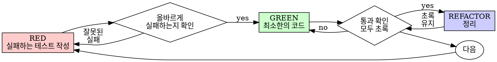

# 테스트 주도 개발 (TDD)

## 개요

테스트를 먼저 작성한다. 실패를 확인한다. 통과할 최소한의 코드를 작성한다.

**핵심 원칙:** 테스트가 실패하는 것을 직접 보지 않았다면, 그 테스트가 올바른 것을 테스트하는지 알 수 없다.

**규칙의 글자를 어기는 것은 규칙의 정신을 어기는 것이다.**

## 사용 시점

**항상:**
- 새로운 기능
- 버그 수정
- 리팩토링
- 동작 변경

**예외 (담당자에게 먼저 확인):**
- 버릴 프로토타입
- 자동 생성된 코드
- 설정 파일

"이번 한 번만 TDD를 건너뛰자"는 생각이 드는가? 멈춰라. 그건 합리화다.

## 철칙

```
실패하는 테스트 없이는 프로덕션 코드도 없다
```

테스트 전에 코드를 작성했는가? 삭제하라. 처음부터 다시 시작하라.

**예외 없음:**
- "참고용으로" 남겨두지 마라
- 테스트를 작성하면서 "수정"하지 마라
- 쳐다보지도 마라
- 삭제는 삭제를 의미한다

테스트로부터 새로 구현한다. 끝.

## Red-Green-Refactor



### RED - 실패하는 테스트 작성

어떤 동작을 해야 하는지 보여주는 최소한의 테스트 하나를 작성한다.

#### [Good]
    
**Java**
```java
@Test
@DisplayName("실패한 작업을 3번 재시도한다")
void retries_failed_operations_3_times() {
    AtomicInteger attempts = new AtomicInteger(0);
    Supplier<String> operation = () -> {
        if (attempts.incrementAndGet() < 3) throw new RuntimeException("fail");
        return "success";
    };

    String result = retryOperation(operation);

    assertEquals("success", result);
    assertEquals(3, attempts.get());
}
```

**C++**
```cpp
TEST(RetryOperationTest, RetriesFailedOperations3Times) {
    int attempts = 0;
    auto operation = [&attempts]() -> std::string {
        if (++attempts < 3) throw std::runtime_error("fail");
        return "success";
    };

    std::string result = retryOperation(operation);

    EXPECT_EQ("success", result);
    EXPECT_EQ(3, attempts);
}
```

**Python**
```python
def test_retries_failed_operations_3_times():
    attempts = 0

    def operation():
        nonlocal attempts
        attempts += 1
        if attempts < 3:
            raise RuntimeError("fail")
        return "success"

    result = retry_operation(operation)

    assert result == "success"
    assert attempts == 3
```
명확한 이름, 실제 동작 테스트, 하나의 관심사

#### <Bad>

**Java**
```java
@Test
void retry_works() {
    Supplier<String> mock = mock(Supplier.class);
    when(mock.get())
        .thenThrow(new RuntimeException())
        .thenThrow(new RuntimeException())
        .thenReturn("success");
    retryOperation(mock);
    verify(mock, times(3)).get();
}
```

**C++**
```cpp
TEST(RetryOperationTest, RetryWorks) {
    MockOperation mock_op;
    EXPECT_CALL(mock_op, call())
        .WillOnce(Throw(std::runtime_error("")))
        .WillOnce(Throw(std::runtime_error("")))
        .WillOnce(Return("success"));
    retryOperation([&]() { return mock_op.call(); });
}
```

**Python**
```python
def test_retry_works(mocker):
    mock_op = mocker.Mock(side_effect=[
        RuntimeError(),
        RuntimeError(),
        "success",
    ])
    retry_operation(mock_op)
    assert mock_op.call_count == 3
```
모호한 이름, 코드가 아닌 mock을 테스트


**요건:**
- 하나의 동작
- 명확한 이름
- 실제 코드 (불가피한 경우에만 mock 사용)

### RED 확인 - 실패를 직접 본다

**필수. 절대 건너뛰지 마라.**

**Java**
```bash
./mvnw test -Dtest=RetryOperationTest
```
**C++**
```bash
./build/tests --gtest_filter=RetryOperationTest.*
```
**Python**
```bash
pytest tests/test_retry_operation.py
```

확인 사항:
- 테스트가 실패한다 (오류가 아님)
- 실패 메시지가 예상과 같다
- 기능이 없어서 실패한다 (오타 때문이 아님)

**테스트가 통과한다?** 기존 동작을 테스트하고 있다. 테스트를 수정하라.

**테스트가 오류를 낸다?** 오류를 수정하고, 올바르게 실패할 때까지 다시 실행하라.

### GREEN - 최소한의 코드

테스트를 통과시킬 가장 단순한 코드를 작성한다.

#### <Good>
**Java**
```java
public <T> T retryOperation(Supplier<T> fn) {
    for (int i = 0; i < 3; i++) {
        try {
            return fn.get();
        } catch (RuntimeException e) {
            if (i == 2) throw e;
        }
    }
    throw new IllegalStateException("unreachable");
}
```

**C++**
```cpp
template<typename T>
T retryOperation(std::function<T()> fn) {
    for (int i = 0; i < 3; i++) {
        try {
            return fn();
        } catch (const std::exception&) {
            if (i == 2) throw;
        }
    }
    throw std::logic_error("unreachable");
}
```

**Python**
```python
def retry_operation(fn):
    for i in range(3):
        try:
            return fn()
        except Exception:
            if i == 2:
                raise
```
통과하기에 충분한 최소한의 코드


#### <Bad>
**Java**
```java
public <T> T retryOperation(
    Supplier<T> fn,
    Integer maxRetries,
    BackoffStrategy backoff,
    Consumer<Integer> onRetry
) {
    // YAGNI
}
```

**C++**
```cpp
template<typename T>
T retryOperation(
    std::function<T()> fn,
    int max_retries = 3,
    BackoffStrategy backoff = BackoffStrategy::LINEAR,
    std::function<void(int)> on_retry = nullptr
) {
    // YAGNI
}
```

**Python**
```python
def retry_operation(
    fn,
    max_retries=None,
    backoff=None,
    on_retry=None,
):
    # YAGNI
    pass
```
과도한 설계


기능을 추가하거나, 다른 코드를 리팩토링하거나, 테스트 범위를 넘어 "개선"하지 마라.

### GREEN 확인 - 통과를 직접 본다

**필수.**

**Java**
```bash
./mvnw test -Dtest=RetryOperationTest
```
**C++**
```bash
./build/tests --gtest_filter=RetryOperationTest.*
```
**Python**
```bash
pytest tests/test_retry_operation.py
```

확인 사항:
- 테스트가 통과한다
- 다른 테스트도 여전히 통과한다
- 출력이 깨끗하다 (오류, 경고 없음)

**테스트가 실패한다?** 테스트가 아닌 코드를 수정하라.

**다른 테스트가 실패한다?** 지금 바로 수정하라.

### REFACTOR - 정리

초록 상태에서만:
- 중복 제거
- 이름 개선
- 헬퍼 추출

테스트를 초록으로 유지한다. 동작을 추가하지 않는다.

### 반복

다음 기능을 위한 다음 실패 테스트로 넘어간다.

## 좋은 테스트

| 품질 | 좋음 | 나쁨 |
|------|------|------|
| **최소화** | 하나의 관심사. 이름에 "and"? 분리하라. | Java: `@Test void validates_email_and_domain_and_whitespace()`<br>C++: `TEST(Suite, ValidatesEmailAndDomainAndWhitespace)`<br>Python: `def test_validates_email_and_domain_and_whitespace():` |
| **명확함** | 이름이 동작을 설명한다 | Java: `@Test void test1()`<br>C++: `TEST(Suite, Test1)`<br>Python: `def test_1():` |
| **의도 표현** | 원하는 API를 보여준다 | 코드가 무엇을 해야 하는지 모호하게 만든다 |

## 순서가 중요한 이유

**"나중에 테스트를 작성해서 동작을 확인할게"**

코드 작성 후에 쓴 테스트는 즉시 통과한다. 즉시 통과한다는 것은 아무것도 증명하지 않는다:
- 잘못된 것을 테스트할 수 있다
- 동작이 아닌 구현을 테스트할 수 있다
- 잊어버린 엣지 케이스를 놓칠 수 있다
- 테스트가 버그를 잡는 것을 한 번도 보지 못했다

테스트-먼저 방식은 테스트가 실패하는 것을 보게 만들어, 실제로 무언가를 테스트하고 있음을 증명한다.

**"이미 모든 엣지 케이스를 수동으로 테스트했어"**

수동 테스트는 임시방편이다. 모든 것을 테스트했다고 생각하지만:
- 무엇을 테스트했는지 기록이 없다
- 코드가 바뀌었을 때 다시 실행할 수 없다
- 압박 상황에서 케이스를 잊기 쉽다
- "해봤을 때 잘 됐어" ≠ 종합적인 테스트

자동화된 테스트는 체계적이다. 매번 동일하게 실행된다.

**"X시간 동안 한 작업을 삭제하는 것은 낭비야"**

매몰 비용의 오류다. 그 시간은 이미 지나갔다. 지금의 선택은:
- 삭제하고 TDD로 다시 작성 (X시간 더, 높은 확신)
- 유지하고 나중에 테스트 추가 (30분, 낮은 확신, 버그 가능성 높음)

"낭비"는 믿을 수 없는 코드를 유지하는 것이다. 진짜 테스트 없는 동작하는 코드는 기술 부채다.

**"TDD는 교조적이야, 실용적이라는 건 상황에 맞게 적응하는 거야"**

TDD야말로 실용적이다:
- 커밋 전에 버그를 발견한다 (디버깅보다 빠름)
- 회귀를 방지한다 (테스트가 즉시 문제를 잡아냄)
- 동작을 문서화한다 (테스트가 코드 사용법을 보여줌)
- 리팩토링을 가능하게 한다 (자유롭게 변경, 테스트가 문제를 잡아냄)

"실용적인" 지름길 = 프로덕션에서 디버깅 = 더 느림.

**"나중에 쓰는 테스트도 같은 목표를 달성해 - 정신이지 의식이 아니야"**

아니다. 나중에 쓰는 테스트는 "이게 뭘 하는가?"에 답한다. 먼저 쓰는 테스트는 "이게 뭘 해야 하는가?"에 답한다.

나중에 쓰는 테스트는 구현에 의해 편향된다. 요구사항이 아닌 내가 만든 것을 테스트한다. 발견한 엣지 케이스가 아닌 기억한 엣지 케이스를 검증한다.

먼저 쓰는 테스트는 구현 전에 엣지 케이스를 발견하게 한다. 나중에 쓰는 테스트는 모든 것을 기억했는지 검증한다 (기억하지 못했다).

30분짜리 나중 테스트 ≠ TDD. 커버리지는 얻고, 테스트가 실제로 동작한다는 증명은 잃는다.

## 흔한 합리화

| 변명 | 현실 |
|------|------|
| "너무 단순해서 테스트할 필요 없어" | 단순한 코드도 깨진다. 테스트는 30초면 된다. |
| "나중에 테스트할게" | 즉시 통과하는 테스트는 아무것도 증명하지 않는다. |
| "나중에 쓰는 테스트도 같은 목표를 달성해" | 나중 테스트 = "이게 뭘 하는가?" 먼저 테스트 = "이게 뭘 해야 하는가?" |
| "이미 수동으로 테스트했어" | 임시방편 ≠ 체계적. 기록 없음, 재실행 불가. |
| "X시간 삭제는 낭비야" | 매몰 비용의 오류. 검증되지 않은 코드를 유지하는 게 기술 부채. |
| "참고용으로 두고, 테스트 먼저 써" | 결국 수정하게 된다. 그게 나중에 테스트 쓰는 것이다. 삭제는 삭제다. |
| "먼저 탐색이 필요해" | 좋다. 탐색 결과는 버리고, TDD로 시작하라. |
| "테스트하기 어려움 = 설계가 불분명함" | 테스트에 귀를 기울여라. 테스트하기 어려움 = 사용하기 어려움. |
| "TDD가 속도를 늦출 거야" | TDD가 디버깅보다 빠르다. 실용적 = 테스트 먼저. |
| "수동 테스트가 더 빠르다" | 수동으로는 엣지 케이스를 증명하지 못한다. 변경할 때마다 다시 테스트해야 한다. |
| "기존 코드에 테스트가 없어" | 개선하고 있는 것이다. 기존 코드에 테스트를 추가하라. |

## 레드 플래그 - 멈추고 처음부터 다시 시작하라

- 테스트 전에 코드 작성
- 구현 후 테스트 작성
- 테스트가 즉시 통과
- 테스트가 왜 실패했는지 설명할 수 없음
- 테스트를 "나중에" 추가
- "이번 한 번만"이라고 합리화
- "이미 수동으로 테스트했어"
- "나중에 쓰는 테스트도 같은 목적을 달성해"
- "정신이지 의식이 아니야"
- "참고용으로 두기" 또는 "기존 코드 수정"
- "이미 X시간 썼는데 삭제는 낭비야"
- "TDD는 교조적이야, 나는 실용적으로 한다"
- "이건 다르다, 왜냐하면..."

**이 모든 것은 의미한다: 코드를 삭제하라. TDD로 처음부터 다시 시작하라.**

## 예제: 버그 수정

**버그:** 빈 이메일이 허용됨

**RED**

**Java**
```java
@Test
@DisplayName("빈 이메일을 거부한다")
void rejects_empty_email() {
    FormResult result = submitForm(new FormData(""));
    assertEquals("Email required", result.getError());
}
```
**C++**
```cpp
TEST(FormTest, RejectsEmptyEmail) {
    FormResult result = submitForm(FormData{""});
    EXPECT_EQ("Email required", result.error);
}
```
**Python**
```python
def test_rejects_empty_email():
    result = submit_form(FormData(email=""))
    assert result.error == "Email required"
```

**RED 확인**

**Java**
```bash
$ ./mvnw test -Dtest=FormTest#rejects_empty_email
FAIL: expected: <Email required> but was: <null>
```
**C++**
```bash
$ ./build/tests --gtest_filter=FormTest.RejectsEmptyEmail
[  FAILED  ] FormTest.RejectsEmptyEmail
Expected: "Email required"
  Actual: ""
```
**Python**
```bash
$ pytest tests/test_form.py::test_rejects_empty_email
FAILED tests/test_form.py::test_rejects_empty_email
AssertionError: assert None == "Email required"
```

**GREEN**

**Java**
```java
public FormResult submitForm(FormData data) {
    if (data.getEmail() == null || data.getEmail().trim().isEmpty()) {
        return FormResult.error("Email required");
    }
    // ...
}
```
**C++**
```cpp
FormResult submitForm(const FormData& data) {
    if (data.email.empty()) {
        return FormResult{"Email required"};
    }
    // ...
}
```
**Python**
```python
def submit_form(data):
    if not data.email or not data.email.strip():
        return FormResult(error="Email required")
    # ...
```

**GREEN 확인**

**Java**
```bash
$ ./mvnw test -Dtest=FormTest#rejects_empty_email
BUILD SUCCESS
```
**C++**
```bash
$ ./build/tests --gtest_filter=FormTest.RejectsEmptyEmail
[  PASSED  ] FormTest.RejectsEmptyEmail
```
**Python**
```bash
$ pytest tests/test_form.py::test_rejects_empty_email
1 passed in 0.01s
```

**REFACTOR**
여러 필드에 대한 검증이 필요하다면 추출한다.

## 검증 체크리스트

작업 완료 전 확인:

- [ ] 모든 새 함수/메서드에 테스트가 있다
- [ ] 구현 전에 각 테스트가 실패하는 것을 직접 봤다
- [ ] 각 테스트가 예상된 이유(기능 없음, 오타 아님)로 실패했다
- [ ] 각 테스트를 통과시킬 최소한의 코드를 작성했다
- [ ] 모든 테스트가 통과한다
- [ ] 출력이 깨끗하다 (오류, 경고 없음)
- [ ] 테스트가 실제 코드를 사용한다 (mock은 불가피한 경우에만)
- [ ] 엣지 케이스와 오류가 다루어졌다

모든 항목에 체크할 수 없다? TDD를 건너뛴 것이다. 처음부터 다시 시작하라.

## 막혔을 때

| 문제 | 해결책 |
|------|--------|
| 테스트 방법을 모른다 | 원하는 API를 작성하라. 먼저 단언을 작성하라. 담당자에게 물어보라. |
| 테스트가 너무 복잡하다 | 설계가 너무 복잡하다. 인터페이스를 단순화하라. |
| 모든 것을 mock해야 한다 | 코드가 너무 결합되어 있다. 의존성 주입을 사용하라. |
| 테스트 설정이 거대하다 | 헬퍼를 추출하라. 여전히 복잡하다면 설계를 단순화하라. |

## 디버깅 통합

버그를 발견했다면? 버그를 재현하는 실패 테스트를 작성하라. TDD 사이클을 따르라. 테스트가 수정을 증명하고 회귀를 방지한다.

테스트 없이 버그를 수정하지 마라.

## 테스팅 안티패턴

mock이나 테스트 유틸리티를 추가할 때는 @testing-anti-patterns.md를 읽어 흔한 함정을 피하라:
- mock 동작 대신 실제 동작을 테스트하는 것
- 프로덕션 클래스에 테스트 전용 메서드 추가
- 의존성을 이해하지 않고 mock 사용

## 최종 규칙

```
프로덕션 코드 → 테스트가 먼저 존재하고 실패했어야 한다
그렇지 않으면 → TDD가 아니다
```

담당자의 허락 없이는 예외 없다.
